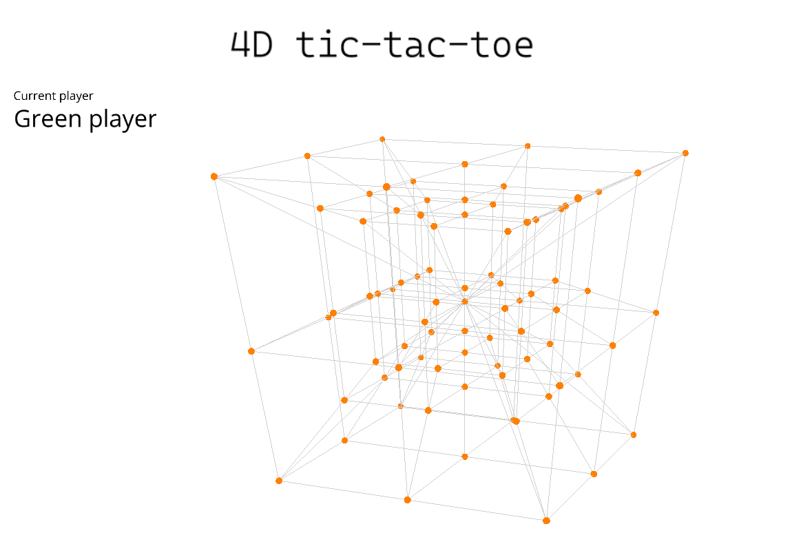

# 4D Tic tac toe

Welcome to my school project that aims at cerating a 4D Tic tac toe visualised as a graph.



## Getting started

Download my repository manualy or using following git command

```git
git clone https://gitlab.mff.cuni.cz/francvoj/4d-tic-tac-toe.git
```

### How to run the file

Create virtual Python enviroment (I'm running Python 3.9.13)
```git bash
python3 -m venv venv
```
Activate virtual Python enviroment
```git bash
source ./muj-venv/Scripts/activate
```
Requirements installation
```git bash
pip install -r requirements.txt
```
Run project
```git bash
python main.py
```
